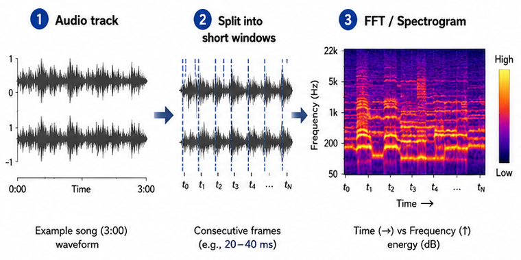
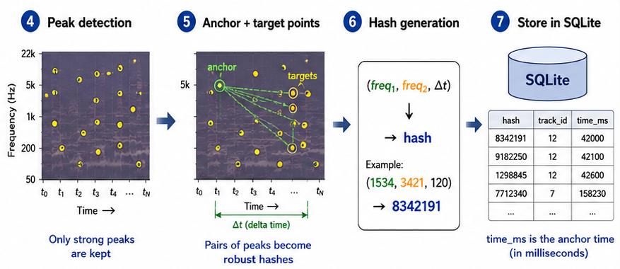
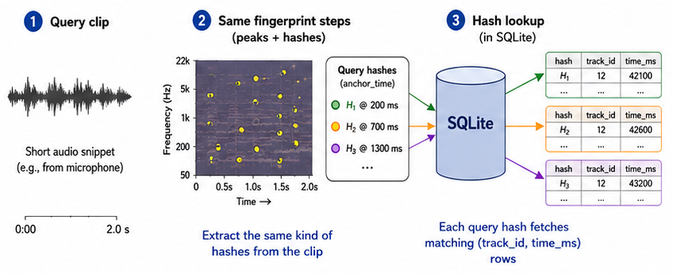
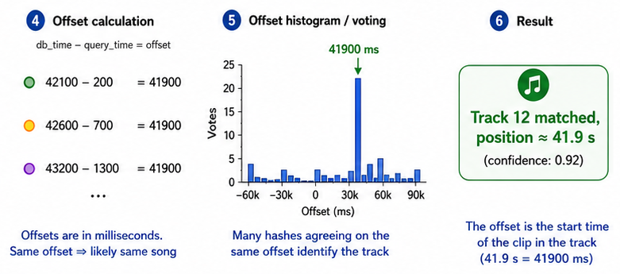

# trackseek

trackseek is a small Shazam-like lab project in Go.

The idea is simple:

- index audio files into a SQLite database
- store audio fingerprints
- take a short sample
- try to find the right track back

Right now this is both:

- a local CLI tool
- a small HTTP server with a match endpoint

# What it does

- reads audio from `.wav` and `.mp3`
- extracts peaks from the spectrum
- builds fingerprint hashes from anchor-target peak pairs in a small forward target zone
- stores fingerprints in SQLite
- matches a sample against stored tracks
- serves static files from `./static`
- accepts uploaded audio samples over HTTP
- returns match results as SSE with JSON data

# Project goal

This project is made for a practical test setup.
Not for perfect production matching yet.

So the focus is:

- simple
- understandable
- fast enough
- easy to extend later

# Current database

The database is SQLite.

Main tables:

- `artists`
- `tracks`
- `fingerprints`

artists

- `id`
- `name`

tracks

- `id`
- `path`
- `title`
- `artist_id`

`tracks.path` is unique.
Indexing the same file path again updates the existing track metadata and replaces its fingerprints.

fingerprints

- `hash`
- `track_id`
- `time_ms`

# Build

```bash
go build
```

Or run directly:

```bash
go run .
```

# Configuration

## `.env`

At startup, trackseek tries to load a local `.env` file.

Right now this is used for the SQLite database path and target sample rate.

Without an override, the fallback database path is relative:

- `fingerprints.sqlite`
- this is resolved relative to the current working directory

Example:

```env
TRACKSEEK_DB_PATH=/home/niels/db/fingerprints.sqlite
TRACKSEEK_TARGET_SAMPLE_RATE=22050
```

If `.env` is missing, trackseek falls back to:

```text
fingerprints.sqlite
```

Using `.env` can make the database location explicit and stable.
That is useful when you want the DB file to stay in a fixed place,
regardless of how or from where you start the program.

At startup, trackseek prints which SQLite file it is using.

You can also set `TRACKSEEK_TARGET_SAMPLE_RATE`.
This keeps resampling configurable so you can trade off fingerprint density, DB size, and match speed.
Without `TRACKSEEK_TARGET_SAMPLE_RATE` the sample rate defaults to 44100.

# Usage

## Index a track

Use `index` with title and artist:

```bash
./trackseek index --artist="Nortsch" --title="Time doesnt exist" ./song.mp3
```

This will:

- read the audio file
- create/find the artist
- create or update the track row for that file path
- replace stored fingerprints for that track

Re-indexing the same file path is safe.
The existing track entry is reused instead of creating a duplicate row.

## List indexed tracks

```bash
./trackseek list
```

Example output:

```text
1  Nortsch - Time doesnt exist [./song.mp3]
2  Unknown Artist - Intro [./Intro.wav]
```

## Match a sample

Basic:

```bash
./trackseek match ./sample.mp3
```

With a minimum accepted score:

```bash
./trackseek match --min-score=100 ./sample.mp3
```

With early stop for clear matches:

```bash
./trackseek match --min-score=100 --threshold=600 ./sample.mp3
```

## Start the HTTP server

Basic:

```bash
./trackseek serve
```

With a custom address:

```bash
./trackseek serve --addr :8081
```

With in-memory fingerprint preload:

```bash
./trackseek serve --preload
```

When the server starts:

- it serves files from `./static`
- `GET /` returns `static/index.html` when present
- asset files like `.js`, `.css`, images, and `/assets/...` are served directly
- unknown frontend routes fall back to `static/index.html`
- `POST /match` accepts an uploaded sample file
- with `--preload`, fingerprint hashes are loaded into an in-memory index at startup
- with `--preload`, `/match` uses the in-memory index instead of SQL fingerprint lookups

# Matching flags

Offsets are grouped in 100 ms buckets. This makes nearby hits count together.

## `--min-score`

This is the minimum score needed to accept a match.

`100` is a good starting point.

Example:

- if best score is `68`
- and `--min-score=100`
- then result is `no matching track found`

## `--threshold`

This is an early stop value.

If a candidate reaches this score during matching,
the matcher stops early and returns that result.

This is useful when you want to save time and resources.

`600` is a good starting point.

If this happens, the output shows:

```text
[early stopped]
```

That means the match was accepted early.

# HTTP API

## Static files

The server uses the `static/` directory.

This is intended for static HTML now,
and later for a React bundle.

It can also work as a small SPA server:

- existing asset files are served directly
- unknown routes fall back to `index.html`

This is useful for React Router or other client-side routing.

Main route:

- `GET /`

## `POST /match`

This route accepts a multipart form upload.

Form fields:

- `sample`
- `minScore` optional
- `threshold` optional

The `sample` field should contain a `.wav` or `.mp3` file.

Example with `curl`:

```bash
curl -N \
  -F "sample=@./match-test.mp3" \
  -F "minScore=100" \
  -F "threshold=600" \
  http://localhost:8080/match
```

If the server was started with `--preload`, this route matches against the preloaded in-memory fingerprint index.
Otherwise it uses the SQLite fingerprint table during the request.

## SSE response

The route returns:

```text
Content-Type: text/event-stream
```

It sends one SSE event named `match`.

Response data is in JSON.

Example successful response:

```text
event: match
data: {"matched":true,"trackId":17,"title":"Time doesnt exist","artist":"Nortsch","path":"./nortsch-time.mp3","score":644,"offsetMs":69474}
```

Example no-match response:

```text
event: match
data: {"matched":false}
```

Example error response:

```text
event: match
data: {"error":"missing form file field 'sample'"}
```

# Example flow

## 1. Index a few songs

```bash
cd tracks
for file in *.wav *.mp3; do
  base="${file%.*}"

  base="${base//_/ }"

  if [[ "$base" == *" - "* ]]; then
    artist="${base%% - *}"
    title="${base#* - }"
  else
    artist=""
    title="$base"
  fi
  echo "Adding $file ..."
  ../trackseek index --title="$title" --artist="$artist" "$file"
done
```

## 2. Test with a sample

```bash
./trackseek match --min-score=100 --threshold=600 ./match-test.mp3
./trackseek match --min-score=100 --threshold=600 ./match-test-fail.mp3
```

## 3. Read the result

Possible output:

```text
best match: track_id=17 title="Time doesnt exist" artist="Nortsch" path=./nortsch-time.mp3 score=1261 offset_ms=69474
```

Or with early stop:

```text
best match: track_id=17 title="Time doesnt exist" artist="Nortsch" path=./nortsch-time.mp3 [early stopped] offset_ms=69474
```

## 4. Test the HTTP endpoint

Start the server:

```bash
./trackseek serve
```

Then call the match endpoint:

```bash
curl -N \
  -F "sample=@./match-test.mp3" \
  -F "minScore=100" \
  -F "threshold=600" \
  http://localhost:8080/match
```

There is also an IDE-friendly request file:

```text
api-test/match.http
```

# Processing details

A detailed explanation of the indexing phase, matching process, and score calculation.

## Indexing




During indexing, trackseek converts an audio file into a set of compact fingerprints.

First, the audio is decoded and converted to mono PCM. The signal is then normalized to a fixed target sample rate so that the same sound produces comparable frequency bins, regardless of the original file format or sample rate.

The audio is split into short overlapping windows. For each window, an FFT is calculated to convert the signal from the time domain into the frequency domain. This produces a spectrogram-like representation: time on one axis, frequency on the other, and magnitude as signal strength.

trackseek then keeps only the strongest local frequency peaks. These peaks are more stable than raw audio samples and are therefore more suitable for matching noisy or partial audio later.

Each fingerprint is created from a pair of peaks:

    freq1   = frequency bin of the anchor peak
    freq2   = frequency bin of the target peak
    delta_t = time difference between anchor and target

These values are combined into a compact hash:

    (freq1, freq2, delta_t) -> hash

The hash is stored in SQLite together with the track ID and the timestamp of the anchor peak:

    hash -> (track_id, time_ms)

So the database does not store the full audio signal. It stores many small fingerprints that describe characteristic peak pairs in the track.

## Matching




Matching uses the same fingerprinting process, but on a shorter query clip.

The query audio is decoded, converted to mono, resampled to the same target sample rate, split into windows, transformed with FFT, and reduced to spectral peaks. trackseek then creates hashes from anchor/target peak pairs in the query clip.

Each query hash is looked up in the SQLite fingerprint database. A single matching hash is not enough to identify a track, because different songs may share some similar peak pairs. The important part is whether many hashes point to the same track at a consistent time offset.

For every matching hash, trackseek compares the timestamp from the database with the timestamp from the query clip:

    offset = db_time_ms - query_time_ms

Example:

| Expression | Result |
| --- | ---: |
| `42100 - 200` | `41900` |
| `42600 - 700` | `41900` |
| `43200 - 1300` | `41900` |

All three matches point to the same offset: `41900 ms`. That means the query clip probably starts around `41.9s` into that track.

trackseek groups offsets into small buckets and counts votes per track and offset bucket. The best match is the track with the strongest concentration of matching hashes at the same offset.

In short:

    many matching hashes + same track + same offset = match

Terminology:

| Term | Meaning |
| --- | --- |
| `freq1`, `freq2` | frequencies of the two peaks |
| `delta_t` | time difference between anchor and target |
| `hash` | compact representation of the peak pair |
| `time_ms` | anchor peak timestamp in the original track |

### Score

The score is the number of query fingerprints that vote for the same indexed track at the same time offset.

Each query fingerprint produces a hash and a timestamp inside the query clip. When that hash is found in the SQLite database, trackseek compares the timestamp from the indexed track with the timestamp from the query:

    offset = db_time_ms - query_time_ms

The match is counted as a vote for this combination:

    track_id + offset_bucket

The offset is bucketed, for example in 100 ms buckets, so tiny timing differences do not split one real match into many separate offsets.

Example:

| Hash | Track ID | DB time | Query time | Offset | Vote |
| --- | ---: | ---: | ---: | ---: | --- |
| `hash_a` | `12` | `42100` | `200` | `41900` | `track 12, offset 41900` |
| `hash_b` | `12` | `42600` | `700` | `41900` | `track 12, offset 41900` |
| `hash_c` | `12` | `43200` | `1300` | `41900` | `track 12, offset 41900` |

All three hashes vote for the same track and the same offset, so the score for that candidate becomes:

    score = 3

A stronger match has many hashes voting for the same `(track_id, offset_bucket)` pair.

Example result:

| Candidate | Score |
| --- | ---: |
| `track 12, offset 41900` | `87` |
| `track 7, offset 12000` | `4` |
| `track 19, offset 70000` | `2` |

The best match is the candidate with the highest score. In this example, track `12` wins because many query fingerprints agree that the clip starts around `41900 ms`, or `41.9s`, into that track.

# Notes

- this is a prototype, not a final production matcher
- track paths are unique, so indexing the same file path updates the existing track instead of duplicating it
